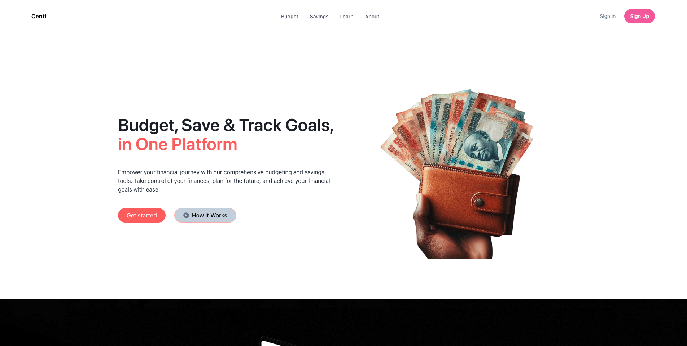
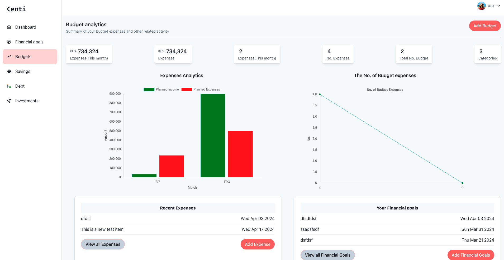
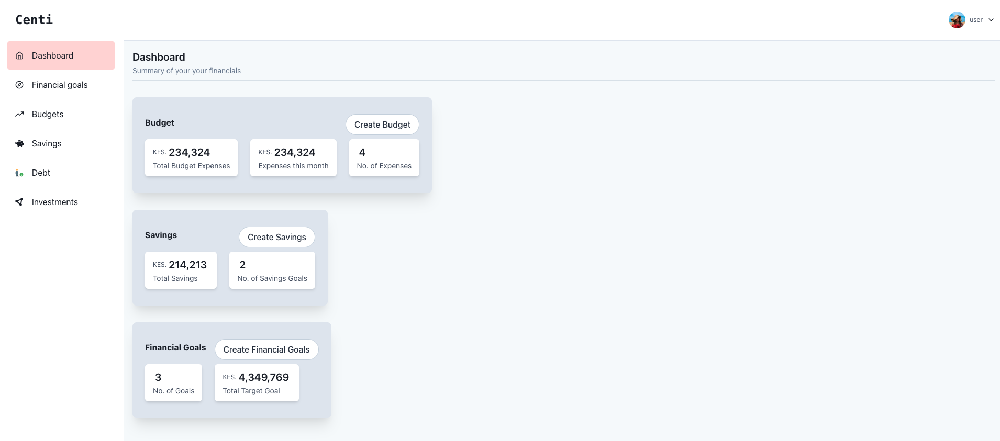

# centi

Centi is a Self managed budgeting and savings tool to achieve financial goals. It provides budgeting and savings tools to help track budgets, savings and financial goals.

## Idea Origin

For the last one year, I've been using a [Google Spreadsheet document](https://docs.google.com/spreadsheets/d/e/2PACX-1vSLdQIWtEFfT2CZoATVp-Fn98nJg2xGuGdHTO-UJbvhoKZ_7YHARXn2sgzuKYq2xzW-2gvIZS_s8G4B/pubhtml?gid=1938380794&single=true) to keep track of my financial planning. This includes keeping track of my monthly budget, tracking financial goals and savings. As you may have noticed, this process is manual and doesn't give me enough automated and control of my financial planning. I couldn't find an existing tool that is in the format that I wanted. So, I decided to create this Centi Project to help me control my financial planning journey. Currently, I've what I need in the beta release and this tool has been helpful.

## Future Plan for this project

I've shown this project to a couple of my friends and they liked it. They even requested for access. Hence, I decided to work on it more and add more features as it can be seen on the issues tab and [Project Roadmap here](https://www.mindmeister.com/app/map/3219797051). I work on this project on weekends majorly and whenever I get free time during the week

Also this project will be converted into a monorepo self managed project unlike at the moment where everything is in one folder but works separately. I've a plan to used [Nx](https://nx.dev) for backend, frontend-client, frontend-admin and infrastructure

### Features:

- **Budget management**: Create, update and delete budget to track expenses and income
- **Savings tracking**: Monitor your savings progress and set savings goals to achieve financial milestones
- **Financial goal**: Set, track and link financial goals to the current budget and savings
- **Dashboard**: Visualize your financial data with interactive charts and graphs for better insights

## Project Folder Structure
128 directories, 250 files

```
.Centi
├── README.md
├── backend
│   ├── README.md
│   ├── nodemon.json
│   ├── package-lock.json
│   ├── package.json
│   ├── processes.json
│   ├── scripts
│   ├── src
│   │   ├── api
│   │   ├── app.js
│   │   ├── config
│   │   ├── db_seed
│   │   ├── helpers
│   │   ├── middlewares
│   │   ├── server.js
│   │   └── services
│   ├── uploads
│   └── yarn.lock
├── compose
├── docker-compose.prod.yml
├── docker-compose.staging.yml
├── docker-compose.test.yml
├── docker-compose.yml
├── frontend-admin
├── frontend-client
│   ├── README.md
│   ├── index.html
│   ├── package.json
│   ├── public
│   ├── src
│   ├── vite.config.js
│   └── yarn.lock
├── package.json
├── scripts
└── yarn.lock
```
## Getting Started

### System Requirements

- Any OS, windows, ubuntu, Mac OS X, etc
- Atleast node version 16
- yarn

### Installation

Clone this repo and install the respective dependencies

```
git clone git@github.com:Nicanor008/centi.git
cd backend
yarn
cd ..
cd frontend-client
yarn
```

### Configuration

on the backend folder, create a `.env` file and copy the contents in `.env.example` into the newly created `.env` file

```
touch .env
cp .env.example .env
```

### Executing/Runnig the apps

Open two terminals, and navigate to the backend and frontend-client folders respectively.

- On the backend folder terminal, start the project with `yarn start`
- On the frontend-client folder terminal, start the frontend with `yarn dev`
- Navigate to the browser with the given url e.g. `http://localhost:5173`
- Create a new user through signup and interact with the system

## Technologies used

### Backend

The backend project is setup with the help of [Yeoman](https://yeoman.io/) and [Express Rest API](https://express-rest-api-generato.readthedocs.io/en/latest/)

- JavaScript
- NodeJS
- Express JS
- MongoDB as the Database
- Passport and jwt - manage user authentication, user session management and and integrate with third party SSO(on next release)

### Frontend
- JavaScript
- ReactJS
- Chakra-ui
- Vite

## Deployment(Hosting)

This project will be deployed on a cloud environment in future, preferably an environment that uses containers. At the moment the frontend is manually hosted on a subdomain in cpanel while backend is deployed through continuous deployment on [Render](https://render.com/)

## Contributions

Contributions are not welcomed at the moment. Majorly, this project is to

- Track my learning and implementation of my technical expertise. and to
- Am still working on the project roadmap and things are subject to change any moment
- Working on stabilising the beta release first

## Author

[Nicanor Korir](https://nicanor.me/)

## Screenshots

### Landing Page



### Budget Dashboard



### Dashboard


